<div align="center">
  <h1>🚀 HARSH CHOUDHARY</h1>
  <h3>💼 Full-Stack AI & ML Engineer | Data Scientist | Problem Solver | AI Agent Architect</h3>
  
  [](https://github.com/HarshChoudhary2003)
  [](https://github.com/HarshChoudhary2003)
  [](https://github.com/HarshChoudhary2003)
  [](https://linkedin.com/in/harsh-choudhary)
  [](mailto:your-email@gmail.com)
</div>

<div align="center">

## 🎨 Animated Visual Showcase

<!-- Animated Typing SVG -->
<a href="https://git.io/typing-svg"></a>

</div>

---

## 🔥 Dynamic Activity & Stats

<div align="center">

<!-- Animated Language Stats -->


<!-- Animated Contribution Graph -->


</div>

---

## ⚡ Live Tech Stack Animation

<div align="center">

<!-- Animated Tech Stack Icons -->

<br/>

<br/>

<br/>


</div>

---

## 🌊 Wave Animation & Dynamic Badges

<div align="center">

<!-- Wave Animation -->


<!-- Dynamic Shields with Animation -->


</div>

---

## 🎯 Animated Skill Progress Bars

<div align="center">

```text
╔════════════════════════════════════════════════════════════╗
║          🚀 REAL-TIME SKILL PROFICIENCY 🚀              ║
╠════════════════════════════════════════════════════════════╣
║                                                            ║
║  🤖 AI/ML Engineering    [████████████████▓░░]  90%        ║
║  🐍 Python Development   [████████████████▓░░]  90%        ║
║  📊 Data Science         [███████████████▓░░░]  85%        ║
║  🌐 Web Development      [██████████████▓░░░░]  80%        ║
║  ☁️  Cloud & DevOps      [██████████████▓░░░░]  80%        ║
║  ⚙️  Automation           [███████████████▓░░░]  85%        ║
║  🔒 Security             [█████████████▓░░░░░]  75%        ║
║                                                            ║
║  📈 Overall Progress: ████████████████▓░░░░ 84%            ║
║                                                            ║
╚════════════════════════════════════════════════════════════╝
```

</div>

---

## 🎬 GitHub Profile Trophy Animation

<div align="center">

<!-- Animated Trophies -->


</div>

---

## 📊 Animated Contribution Snake

<div align="center">

<!-- Snake eating contributions -->
<picture>
  <source media="(prefers-color-scheme: dark)" srcset="https://raw.githubusercontent.com/HarshChoudhary2003/HarshChoudhary2003/output/github-contribution-grid-snake-dark.svg">
  <source media="(prefers-color-scheme: light)" srcset="https://raw.githubusercontent.com/HarshChoudhary2003/HarshChoudhary2003/output/github-contribution-grid-snake.svg">
  
</picture>

</div>

---

## 🎨 Animated Code Activity

<div align="center">

<!-- WakaTime-style stats -->


</div>

---

## 🌟 Animated Profile Views Counter

<div align="center">

<!-- Animated Counter -->


<!-- GitHub Stats with Animation -->


</div>

---


---

## 🎯 Professional Summary

> Building **intelligent systems** that transform complex problems into elegant AI solutions. Passionate about **Machine Learning**, **Data Science**, and creating **production-ready AI agents**. Expertise in automating workflows and delivering **high-impact technical solutions** that drive business value.

---

## 📊 GitHub Statistics

<div align="center">
  <table>
    <tr>
      <th>📈 Metric</th>
      <th>📊 Value</th>
      <th>📌 Status</th>
    </tr>
    <tr>
      <td>📁 Repositories</td>
      <td><strong>48+</strong></td>
      <td>✅ Active</td>
    </tr>
    <tr>
      <td>⭐ Stars Received</td>
      <td><strong>6+</strong></td>
      <td>🔥 Growing</td>
    </tr>
    <tr>
      <td>👥 Followers</td>
      <td><strong>4+</strong></td>
      <td>📈 Increasing</td>
    </tr>
    <tr>
      <td>✍️ Commits (This Year)</td>
      <td><strong>363+</strong></td>
      <td>🚀 Productive</td>
    </tr>
    <tr>
      <td>📚 Public Gists</td>
      <td><strong>5+</strong></td>
      <td>💡 Helpful</td>
    </tr>
  </table>
</div>

<div align="center">
  
</div>

<div align="center">
  
</div>

---

## 🛠️ Technical Skills & Expertise

### 🤖 AI & Machine Learning
| Specialization | Technologies | Proficiency |
|---|---|---|
| **Deep Learning** | TensorFlow, PyTorch, Keras, LSTM, CNN, Transformers, GANs | ⭐⭐⭐⭐⭐ |
| **NLP & LLMs** | OpenAI API, Hugging Face, LangChain, Text Processing, Sentiment Analysis, Fine-tuning | ⭐⭐⭐⭐⭐ |
| **Computer Vision** | OpenCV, YOLO, Image Recognition, Object Detection | ⭐⭐⭐⭐ |
| **ML Ops** | MLflow, Model Deployment, A/B Testing, Model Monitoring | ⭐⭐⭐⭐ |
| **Time Series** | ARIMA, Prophet, LSTM, Forecasting Models | ⭐⭐⭐⭐ |

### 💻 Programming & Web Development
| Category | Technologies | Proficiency |
|---|---|---|
| **Languages** | Python, C++, SQL, JavaScript | ⭐⭐⭐⭐⭐ |
| **Backend** | FastAPI, Flask, Django, RESTful APIs | ⭐⭐⭐⭐ |
| **Frontend** | React, HTML5, CSS3, Responsive Design | ⭐⭐⭐⭐ |
| **Databases** | PostgreSQL, MongoDB, MySQL, Redis | ⭐⭐⭐⭐ |
| **Cloud & DevOps** | AWS, Google Cloud, Docker, Kubernetes | ⭐⭐⭐⭐ |

### 📊 Data Science & Analytics
| Specialization | Technologies | Proficiency |
|---|---|---|
| **Data Analysis** | Pandas, NumPy, Scikit-learn, Statistics | ⭐⭐⭐⭐⭐ |
| **Visualization** | Matplotlib, Seaborn, Plotly, Power BI | ⭐⭐⭐⭐ |
| **Big Data** | Spark, Hadoop, Distributed Computing | ⭐⭐⭐ |
| **ETL & Pipelines** | Apache Airflow, Kafka, Data Engineering | ⭐⭐⭐⭐ |

### 🚀 Automation & Workflow
| Category | Technologies | Proficiency |
|---|---|---|
| **Workflow Automation** | n8n, Zapier, Make.com | ⭐⭐⭐⭐⭐ |
| **AI Agents** | OpenAI, CrewAI, LangChain Agents | ⭐⭐⭐⭐⭐ |
| **Chatbots** | Custom LLM Chatbots, Dialog Management | ⭐⭐⭐⭐⭐ |
| **API Integration** | REST APIs, GraphQL, Webhooks | ⭐⭐⭐⭐ |

### 📚 Additional Tools & Frameworks
- **Version Control**: Git, GitHub, GitLab
- **IDEs**: VS Code, Google Colab, Jupyter Notebook
- **Documentation**: Markdown, Sphinx, Mermaid Diagrams
- **Testing**: Pytest, Unit Testing, Integration Testing
- **Monitoring**: Prometheus, Grafana, ELK Stack

---

## 🏆 Key Expertise Areas

```
┌─────────────────────────────────────────────────────────────┐
│                    EXPERTISE ROADMAP                        │
├─────────────────────────────────────────────────────────────┤
│                                                             │
│  🎯 AI Agent Development              ████████████░ 90%   │
│  📊 Data Science & Analytics           ███████████░░ 85%   │
│  🤖 NLP & LLM Fine-tuning             ███████████░░ 85%   │
│  💻 Full-Stack Development             ██████████░░░ 80%   │
│  🚀 Workflow Automation                ███████████░░ 85%   │
│  📈 Power BI & Data Visualization      █████████░░░░ 75%   │
│  ☁️  Cloud Architecture                █████████░░░░ 75%   │
│  🔒 Security & Best Practices          ██████████░░░ 80%   │
│                                                             │
└─────────────────────────────────────────────────────────────┘
```

---

## 💼 Professional Experience Highlights

### 🎯 Key Achievements
- **Developed 48+ AI/ML projects** with focus on production-ready solutions
- **Automated 10+ complex workflows** using n8n, reducing manual effort by 80%
- **Built custom AI chatbots & agents** using OpenAI APIs and LangChain
- **Optimized data pipelines** improving processing speed by 60%
- **Mentored 5+ junior developers** in ML and AI practices
- **Deployed 12+ models to production** on AWS and Google Cloud
- **Created 30+ educational contents** on Data Science and AI

---

## 📚 Featured Projects & Repositories

> 🔗 **Check out my repositories for**: AI Agents, ML Models, Data Science Projects, Web Applications, Automation Workflows

---

## 📖 Learning & Growth Path

```
2024-2025 Learning Goals:
✅ Advanced LLM Fine-tuning & RAG Systems
✅ Production ML Deployment at Scale
✅ Advanced Data Engineering
✅ Cloud Architecture Optimization
✅ Contributing to Open Source
```

---

## 🌐 Connect With Me

<div align="center">
  
  **Let's collaborate on impactful AI & Data Science projects!**
  
  [](https://linkedin.com/in/harsh-choudhary)
  [](https://github.com/HarshChoudhary2003)
  [](mailto:your-email@gmail.com)
  [](https://twitter.com/yourhandle)
  
</div>

---

## 📊 Activity & Contributions

<div align="center">
  
</div>

---

<div align="center">
  
  ### ⚡ Let's build the future of AI together!
  
  
  
</div>

---

## 📈 Skills Distribution Breakdown

```
┌──────────────────────────────────────────────────────┐
│          TECHNICAL COMPETENCY MATRIX                 │
├──────────────────────────────────────────────────────┤
│                                                      │
│ 🤖 Machine Learning      ████████████░░░ 85%       │
│ 💻 Web Development       ███████████░░░░ 80%       │
│ 📊 Data Science          ████████████░░░ 85%       │
│ 🚀 Cloud/DevOps          ██████████░░░░░ 75%       │
│ ⚙️ Automation            ████████████░░░ 85%       │
│ 📱 Full-Stack Development ███████████░░░░ 80%       │
│ 🔒 Security & Best Prac  ██████████░░░░░ 75%       │
│                                                      │
└──────────────────────────────────────────────────────┘
```

---

## 🏗️ Technology Ecosystem

```mermaid
graph TD
    A["🎯 Full-Stack AI Engineer"] --> B["🤖 AI/ML Layer"]
    A --> C["💻 Development"]
    A --> D["📊 Data Science"]
    A --> E["🚀 Automation"]
    
    B --> B1["Deep Learning<br/>TensorFlow, PyTorch"]
    B --> B2["NLP & LLMs<br/>OpenAI, LangChain"]
    B --> B3["Computer Vision<br/>OpenCV, YOLO"]
    B --> B4["ML Ops<br/>MLflow, Model Deployment"]
    
    C --> C1["Backend<br/>FastAPI, Django, Flask"]
    C --> C2["Frontend<br/>React, HTML5, CSS3"]
    C --> C3["Databases<br/>PostgreSQL, MongoDB"]
    C --> C4["Cloud<br/>AWS, GCP, Docker"]
    
    D --> D1["Analysis<br/>Pandas, NumPy, Scikit"]
    D --> D2["Visualization<br/>Power BI, Plotly"]
    D --> D3["Big Data<br/>Spark, Hadoop"]
    D --> D4["ETL Pipelines<br/>Airflow, Kafka"]
    
    E --> E1["Workflow<br/>n8n, Zapier"]
    E --> E2["AI Agents<br/>CrewAI, OpenAI"]
    E --> E3["Chatbots<br/>LLM-based"]
    E --> E4["API Integration<br/>REST, GraphQL"]
```



---

## 📊 Project Portfolio Distribution

```
╔════════════════════════════════════════════════════════╗
║          PROJECT DISTRIBUTION BY CATEGORY              ║
╠════════════════════════════════════════════════════════╣
║                                                        ║
║  AI/ML Projects        ██████████████░░░ 35% (16+)   ║
║  Data Science          █████████░░░░░░░░ 25% (12+)   ║
║  Web Applications      ████████░░░░░░░░░ 20% (10+)   ║
║  Automation Workflows  █████░░░░░░░░░░░░ 15% (7+)    ║
║  Other/Misc           ██░░░░░░░░░░░░░░░  5% (3+)    ║
║                                                        ║
╚════════════════════════════════════════════════════════╝
```

---

## 🎯 2025 Learning & Development Roadmap

```
┌─────────────────────────────────────────────────────────────┐
│                    2025 GROWTH TRAJECTORY                    │
├─────────────────────────────────────────────────────────────┤
│                                                             │
│ Q1 2025                                                     │
│  └─ Advanced LLM Fine-tuning & RAG Systems  ✓             │
│  └─ Vector Databases & Embeddings          ✓             │
│                                                             │
│ Q2 2025                                                     │
│  └─ Production ML Deployment at Scale      ◐             │
│  └─ Kubernetes & Advanced DevOps           ◐             │
│                                                             │
│ Q3 2025                                                     │
│  └─ Advanced Data Engineering               ◐             │
│  └─ Real-time Data Processing              ◐             │
│                                                             │
│ Q4 2025                                                     │
│  └─ Open Source Contribution                ○             │
│  └─ Industry Certifications                 ○             │
│                                                             │
└─────────────────────────────────────────────────────────────┘
```

---

## 💡 Expertise Heatmap

```
╔═══════════════════════════════════════════════════════╗
║           PROFICIENCY HEATMAP (BY DOMAIN)            ║
╠═══════════════════════════════════════════════════════╣
║                                                       ║
║ Domain                    Expertise Level             ║
║ ─────────────────────────────────────────────────   ║
║ AI/ML Engineering         [████████████░░░] 90%    ║
║ Python Programming        [████████████░░░] 90%    ║
║ Data Analysis & Viz       [███████████░░░░] 85%    ║
║ NLP & LLM Applications    [███████████░░░░] 85%    ║
║ Backend Development       [██████████░░░░░] 80%    ║
║ Cloud Architecture        [██████████░░░░░] 80%    ║
║ Workflow Automation       [███████████░░░░] 85%    ║
║ Frontend Development      [█████████░░░░░░] 75%    ║
║ DevOps & Deployment      [██████████░░░░░] 80%    ║
║                                                       ║
╚═══════════════════════════════════════════════════════╝
```

---

## 📈 Contribution & Impact Metrics

```
╔════════════════════════════════════════════════════════╗
║           PROFESSIONAL MILESTONES (2024-2025)         ║
╠════════════════════════════════════════════════════════╣
║                                                        ║
║  🚀 48+ Repositories Created                         ║
║     │                                                 ║
║     ├─ 📁 16+ AI/ML Projects                          ║
║     ├─ 📊 12+ Data Science Projects                   ║
║     ├─ 🌐 10+ Web Applications                         ║
║     └─ ⚙️  10+ Automation Workflows                    ║
║                                                        ║
║  ⭐ 363+ Commits This Year                            ║
║     │                                                 ║
║     ├─ 🔥 ~1 Commit per day average                   ║
║     ├─ 💪 Peak: 15+ commits per week                  ║
║     └─ 📈 Consistent growth trajectory                ║
║                                                        ║
║  🎓 30+ Educational Contents Created                  ║
║     │                                                 ║
║     ├─ 📝 Medium Articles & Blogs                      ║
║     ├─ 🎬 Technical Videos & Tutorials                ║
║     └─ 📖 Comprehensive Guides & Docs                 ║
║                                                        ║
║  🏆 12+ Models Deployed to Production                 ║
║     │                                                 ║
║     ├─ ☁️  AWS & Google Cloud                          ║
║     ├─ 🔒 Enterprise-grade Security                   ║
║     └─ 📊 Real-time Monitoring & MLOps                ║
║                                                        ║
╚════════════════════════════════════════════════════════╝
```

---

## 🔄 Development Workflow Pipeline

```
┌─────────────────────────────────────────────────────┐
│         DEVELOPMENT & DEPLOYMENT PIPELINE           │
├─────────────────────────────────────────────────────┤
│                                                     │
│  📝 Design & Planning                              │
│        │                                           │
│        ▼                                           │
│  💻 Development                                    │
│        │                                           │
│        ▼                                           │
│  🧪 Testing & Validation                          │
│        │                                           │
│        ▼                                           │
│  🔍 Code Review                                    │
│        │                                           │
│        ▼                                           │
│  ☁️ Deployment                                     │
│        │                                           │
│        ▼                                           │
│  📊 Monitoring & Optimization                      │
│        │                                           │
│        ▼                                           │
│  🔄 Continuous Improvement                         │
│                                                     │
└─────────────────────────────────────────────────────┘
```

---

