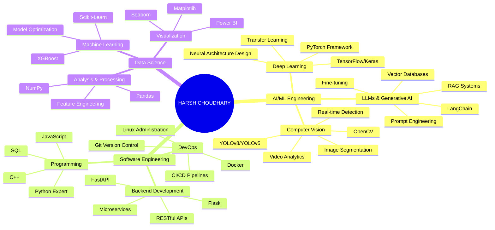
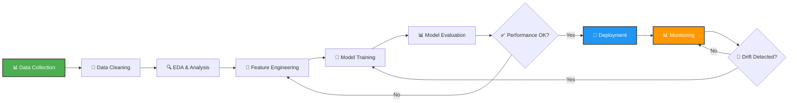

<div align="center">

# 🚀 HARSH CHOUDHARY
## Full-Stack AI & ML Engineer | Data Scientist | Problem Solver


---

## 🎯 Quick Stats

<div align="center">

| Metric | Count |
|:------:|:-----:|
| 📦 Repositories | 48+ |
| ⭐ Stars Received | 6+ |
| 👥 Followers | 4+ |
| 📝 Commits | 363+ |
| 🏆 Projects Completed | 15+ |

</div>

---

</div>

<!-- Animated Header Banner -->
<div align="center">
  
</div>

<!-- Typing Animation -->
<div align="center">
  
</div>

<br>

## 📄 About Me

<table>
<tr>
<td width="60%" valign="top">

### 👨‍💼 Professional Summary

I'm a passionate **Full-Stack AI/ML Engineer** and **Data Scientist** with expertise in building production-grade intelligent systems. My journey spans from theoretical deep learning to real-world deployments.

**🎓 Education:** Bachelor of Computer Applications (BCA)

**💼 Specializations:**
- 🤖 **Deep Learning & Neural Networks** - PyTorch, TensorFlow
- 🖼️ **Computer Vision** - Real-time detection, segmentation, tracking
- 🧠 **LLM & Generative AI** - RAG systems, fine-tuning, prompt engineering
- 📊 **Data Science & Analytics** - Statistical modeling, ML pipelines
- 🏗️ **MLOps & Deployment** - Docker, CI/CD, model serving

**🚠 Current Focus Areas:**
- Advanced Computer Vision with real-time processing
- Building RAG systems for LLMs
- Production ML infrastructure
- AI-powered automation solutions
- Open-source contributions

</td>
<td width="40%" align="center" valign="top">

### 📝 Key Highlights

```
┌────────────────────┐
│  🌟 ACHIEVEMENTS        │
├────────────────────┤
│  ✅ 48+ Repositories     │
│  ✅ 363+ Contributions   │
│  ✅ 15+ Projects        │
│  ✅ 6+ Stars Received    │
│  ✅ 4+ Followers        │
│  ✅ Python Expert       │
│  ✅ ML/AI Specialist    │
└────────────────────┘
```

</td>
</tr>
</table>

---

## 💻 Tech Stack Expertise

### 🤖 AI/ML Frameworks
<div align="center">

| Framework | Use Case | Proficiency | Projects |
|:---:|:---:|:---:|:---:|
| **TensorFlow** | Neural Networks, CV | ⭐⭐⭐⭐⭐ | 10+ |
| **PyTorch** | Deep Learning, Custom Models | ⭐⭐⭐⭐⭐ | 12+ |
| **OpenCV** | Real-time Processing, Detection | ⭐⭐⭐⭐⭐ | 8+ |
| **LangChain** | LLM Apps, RAG Systems | ⭐⭐⭐⭐⭐ | 6+ |
| **scikit-learn** | Classical ML, Preprocessing | ⭐⭐⭐⭐⭐ | 15+ |

</div>

### 📊 Data Science Tools
<div align="center">

| Tool | Purpose | Level |
|:---:|:---:|:---:|
| **Pandas** | Data Manipulation & Analysis | Expert |
| **NumPy** | Numerical Computing | Expert |
| **Matplotlib/Seaborn** | Data Visualization | Advanced |
| **Power BI** | Business Intelligence | Intermediate |
| **SQL** | Database Management | Expert |

</div>

### 💻 Programming Languages
<div align="center">


</div>

### 🚀 DevOps & Infrastructure
<div align="center">


</div>

---

## 📂 Featured Projects

### 🏆 Major Repositories

<div align="center">

| Project | Description | Tech Stack | Status | Links |
|:--------|:------------|:-----------|:------:|:------|
| **🔷 [Open-CV-Projects](https://github.com/HarshChoudhary2003/Open-CV-Projects)** | 21+ Computer Vision modules with real-time face detection, object tracking, hand gesture recognition | OpenCV, Python, NumPy | 🟢 Active | [](https://github.com/HarshChoudhary2003/Open-CV-Projects) |
| **🔶 [AI-Agents-Automation](https://github.com/HarshChoudhary2003/AI-Agents-Automation)** | Autonomous LLM-based workflow automation engine for multi-step task execution | LangChain, OpenAI, Python | 🟢 Active | [](https://github.com/HarshChoudhary2003/AI-Agents-Automation) |
| **📊 [Data-Science-Portfolio](https://github.com/HarshChoudhary2003/Data-Science-Portfolio)** | End-to-end data analytics with ML model development & evaluation | Pandas, Scikit-Learn, SQL | 🟢 Active | [](https://github.com/HarshChoudhary2003/Data-Science-Portfolio) |
| **🎓 [Machine-Learning-Projects](https://github.com/HarshChoudhary2003/Machine_Learning_Projects)** | Collection of supervised & unsupervised ML models | Scikit-Learn, TensorFlow | 🟢 Active | [](https://github.com/HarshChoudhary2003/Machine_Learning_Projects) |

</div>

### 💡 Project Highlights

```python
# Sample: Real-time Face Detection with OpenCV
import cv2
import numpy as np

class FaceDetector:
    def __init__(self, model='haarcascade'):
        self.face_cascade = cv2.CascadeClassifier(
            cv2.data.haarcascades + 'haarcascade_frontalface_default.xml'
        )
    
    def detect_faces(self, frame):
        gray = cv2.cvtColor(frame, cv2.COLOR_BGR2GRAY)
        faces = self.face_cascade.detectMultiScale(gray, 1.1, 4)
        
        for (x, y, w, h) in faces:
            cv2.rectangle(frame, (x, y), (x+w, y+h), (0, 255, 0), 2)
        
        return frame, len(faces)

# Real-time detection
detector = FaceDetector()
cap = cv2.VideoCapture(0)

while True:
    ret, frame = cap.read()
    frame, count = detector.detect_faces(frame)
    cv2.imshow('Face Detection', frame)
    if cv2.waitKey(1) & 0xFF == ord('q'):
        break

cap.release()
cv2.destroyAllWindows()
```

---

## 📈 GitHub Analytics

<div align="center">

### 📊 Performance Metrics


### 📅 Contribution Graph


</div>

---

## 🧠 Technical Architecture & Workflows

### 🗯a️ Skills Mind Map



### 🔄 ML Pipeline Workflow



---

## 🏆 Achievements & Certifications

<div align="center">


</div>

---

## 🎯 Current Learning & Focus

<div align="center">

<table>
<tr>
<td width="50%" valign="top">

### 📅 2026 Roadmap

- ✅ **Q1 2026:** Advanced RAG Systems
- 🔄 **Q2 2026:** Production MLOps
- 💡 **Q3 2026:** LLM Fine-tuning
- 🎯 **Q4 2026:** Real-time CV Systems

</td>
<td width="50%" valign="top">

### 🚀 Active Exploration

- 🤖 **Transformers & Attention**
- 🔍 **Vector Databases (Pinecone, Weaviate)**
- 📦 **Model Optimization & Quantization**
- ☁️ **Cloud ML (AWS SageMaker, GCP)**

</td>
</tr>
</table>

</div>

---

## 📞 Connect With Me

<div align="center">

### 👋 Let's Build Something Amazing Together!

[](https://linkedin.com/in/harsh--choudhary)
[](mailto:hc504360@gmail.com)
[](https://t.me/CodeMeetsData)
[](https://github.com/HarshChoudhary2003)

### ☕ Support My Work

[](https://www.buymeacoffee.com/harshchoudhary)

</div>

---

<div align="center">

### 💬 Quote of the Day


</div>

---

<!-- Footer Wave -->
<div align="center">
  
</div>

<div align="center">
  <sub>⭐ <b>If you find my work interesting, don't forget to star my repositories!</b> ⭐</sub>
  <br>
  <sub>🚀 <i>Building the Future with AI, One Commit at a Time</i> 🚀</sub>
  <br><br>
  <sub>© 2026 Harsh Choudhary | All Rights Reserved</sub>
  <br>
  <sub>Made with ❤️ and lots of ☕</sub>
</div>

<!-- Profile Counter -->
<div align="center">
  
</div>
