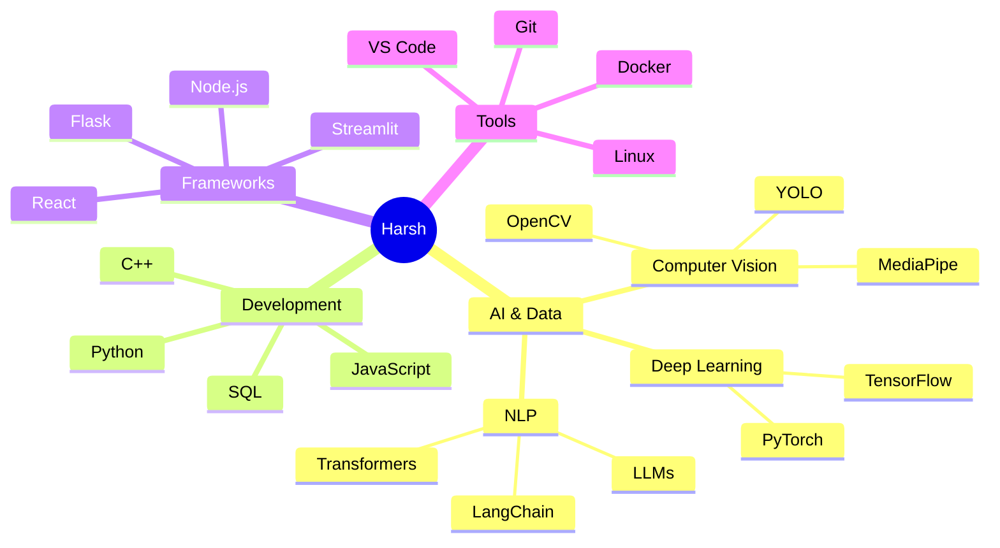
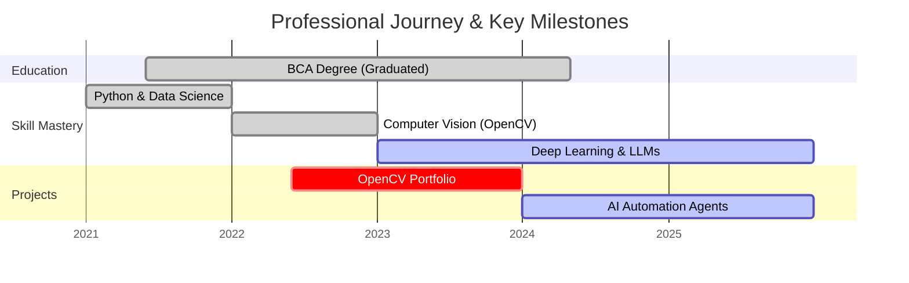

  
  
  

  <!-- Social Links -->
  

     
    
    
  

  

---

## 👨‍💻 About Me

I am a **BCA graduate** and a passionate developer lying at the intersection of **Data Science, Artificial Intelligence, and Software Engineering**. 

My core philosophy is simple: **"Code that solves problems, scales cleanly, and delivers value."**

I specialize in building:
*   **Computer Vision Systems**: Using OpenCV and Deep Learning for real-time analysis.
*   **AI Agents**: Creating autonomous workflows using LLMs.
*   **Data Pipelines**: From raw data to actionable insights.
*   **Full Stack Applications**: Integrating powerful AI backends with intuitive frontends.

---

## 🧠 Skill Ecosystem using Mermaid

### 🗺️ Skills Mindmap

### 📅 My Journey Timeline

---

## 🛠️ Technical Arsenal

| **Languages** | **AI / ML / Data Science** | **Tools & Platforms** |
|:---:|:---:|:---:|
|  |  |  |

---

## 🐍 Contribution Snake

  

---

## 🎲 Random Dev Joke

  

---

## 📁 Featured Projects - Deep Dive

<b>👁️ Computer Vision & Processing (Click to Expand)</b>

 

| Project | Stack | Description |
|:---|:---|:---|
| [**Open-CV-Projects**](https://github.com/HarshChoudhary2003/Open-CV-Projects) | `Python` `OpenCV` | A comprehensive suite of 21+ computer vision implementations including face detection, object tracking, and image segmentation. |

<b>🤖 AI Agents & Automation (Click to Expand)</b>

 

| Project | Stack | Description |
|:---|:---|:---|
| [**AI Agents & Automation**](https://github.com/HarshChoudhary2003/AI-Agents-Automation) | `LangChain` `Python` `LLMs` | Building autonomous agents that can browse the web, scrape data, and perform complex multi-step tasks without human intervention. |

<b>📊 Data Science & Analytics (Click to Expand)</b>

 

| Project | Stack | Description |
|:---|:---|:---|
| [**Data Science Portfolio**](https://github.com/HarshChoudhary2003/Data-Science-Portfolio) | `Pandas` `Scikit-learn` `Jupyter` | End-to-end data analysis projects involving data cleaning, EDA, feature engineering, and predictive modeling. |

<b>🌐 Full Stack Applications (Click to Expand)</b>

 

| Project | Stack | Description |
|:---|:---|:---|
| [**Full-Stack Apps**](https://github.com/HarshChoudhary2003/Full-Stack-Apps) | `React` `Node.js` `Flask` | Monorepo containing full-stack applications that demonstrate the integration of Modern UI with AI-powered backends. |

---

## 📊 GitHub Analytics

<table>
  <tr>
    <td align="center" width="50%">
      
    </td>
    <td align="center" width="50%">
      
    </td>
  </tr>
</table>

### 🏆 Trophies

### 🔥 Contribution Streak

### 📅 Productivity Output

  
  

---

  
  <i>Let's connect and build something amazing together!</i>
   
  
  
  

