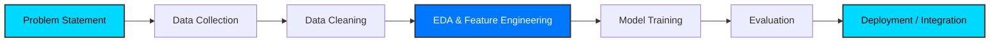

  
  
  

  <!-- Social Links -->
   
  

---

## 👨‍💻 About Me

I’m a **BCA graduate** passionate about bridging the gap between data and real-world solutions. My focus is on **Artificial Intelligence, Computer Vision, and Data Science**. 

I believe in building systems that are not just experimental but **production-ready**.

- 🔭 **I’m currently working on:** AI Agents & Automation workflows.
- 🌱 **I’m currently learning:** Advanced Computer Vision & MLOps.
- 💬 **Ask me about:** Python, OpenCV, Data Science Pipelines.
- ⚡ **Fun fact:** I strive to make code that "scales cleanly."

---

## 🛠️ Tech Stack

| **Languages** | **AI / ML / Data Science** | **Tools & Platforms** |
|:---:|:---:|:---:|
|  |  |  |

---

## 📁 Featured Projects

| 🏆 Project | 📝 Description | 🚦 Status |
|:---|:---|:---:|
| [**Open-CV-Projects**](https://github.com/HarshChoudhary2003/Open-CV-Projects) | A collection of 21+ Computer Vision projects demonstrating processing & analysis. | ✅ Active |
| [**AI Agents & Automation**](https://github.com/HarshChoudhary2003/AI-Agents-Automation) | Intelligent workflow automation systems designed for efficiency. | 🔄 In Progress |
| [**Data Science Portfolio**](https://github.com/HarshChoudhary2003/Data-Science-Portfolio) | Comprehensive ML models, data analysis, and visualization projects. | ✅ Active |
| [**Full-Stack Apps**](https://github.com/HarshChoudhary2003/Full-Stack-Apps) | End-to-end applications integrating AI with modern web frameworks. | ✅ Active |

---

## 📊 GitHub Analytics

<table>
  <tr>
    <td align="center" width="50%">
      
    </td>
    <td align="center" width="50%">
      
    </td>
  </tr>
</table>

 

 

---

## 🧠 AI Project Workflow

