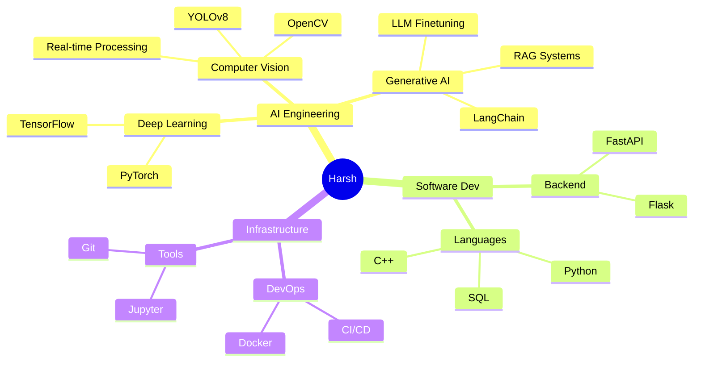

  
  
   
  
  

   

  <!-- Social Badges -->
  

    
    &nbsp; 
    
    &nbsp;
    
  

  
   

---

## 👨‍💼 Executive Profile

<table>
  <tr>
    <td width="65%" valign="top">
      <h3>Hello, I'm Harsh.</h3>
      

        I am a <b>Software Engineer</b> specializing in <b>Artificial Intelligence</b> and <b>Data Science</b>. My expertise lies in designing and deploying scalable AI solutions that solve complex real-world problems.
      

      

        I bridge the gap between <b>research-grade ML algorithms</b> and <b>production-level software engineering</b>. I focus on writing clean, maintainable code and building architectures that stand the test of time.
      

      <ul>
        <li>🚀 <b>Core Focus:</b> Computer Vision, LLM-based Agents, and End-to-End MLOps.</li>
        <li>💡 <b>Approach:</b> First principles thinking + Engineering rigor.</li>
        <li>🌍 <b>Goal:</b> Delivering high-impact AI systems.</li>
      </ul>
    </td>
    <td width="35%" align="center">
      
    </td>
  </tr>
</table>

---

## 🛠️ Technology Stack

| **Core Domains** | **Technologies** |
|:---|:---|
| 🤖 **AI & Deep Learning** |     |
| 📊 **Data Science** |    |
| 💻 **Development** |    |
| 🔧 **Tools & DevOps** |    |

---

## 📂 Key Projects

| 🏆 **Project** | 🛠️ **Stack** | 📝 **Description** |
|:---|:---|:---|
| [**Open-CV-Projects**](https://github.com/HarshChoudhary2003/Open-CV-Projects) | `OpenCV` `Python` | A robust collection of 21+ computer vision modules including real-time face detection, object tracking, and image segmentation production pipelines. |
| [**AI Agents Automation**](https://github.com/HarshChoudhary2003/AI-Agents-Automation) | `LangChain` `LLMs` | Autonomous agent framework design to execute multi-step workflows, web scraping, and intelligent decision making without human oversight. |
| [**Data Science Portfolio**](https://github.com/HarshChoudhary2003/Data-Science-Portfolio) | `Pandas` `Sklearn` | Comprehensive statistical analysis and predictive modeling suite, demonstrating end-to-end data lifecycle management. |

---

## 🧠 Workflows & Skills

### 🗺️ Technical Mindmap

---

## 📈 Engineering Metrics

  
  

 

  

---

  
© 2024 Harsh Choudhary | <i>Innovating with Code</i>

