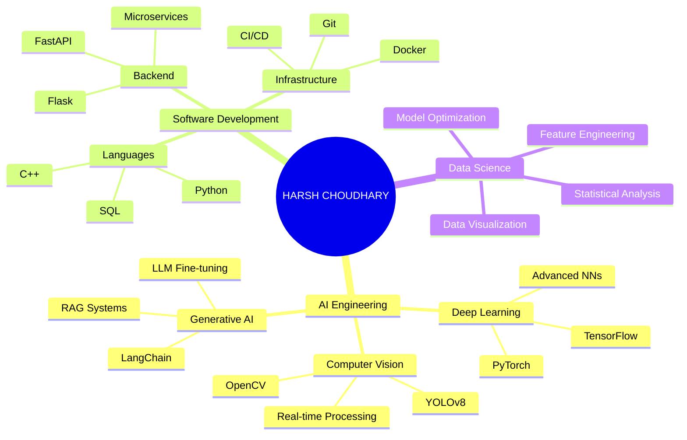

<div align="center">
  
</div>

<div align="center">
  
</div>

<br/>

<div align="center">
  <a href="https://linkedin.com/in/harsh--choudhary" target="_blank">
    
  </a>
  &nbsp;
  <a href="mailto:hc504360@gmail.com" target="_blank">
    
  </a>
  &nbsp;
  <a href="https://github.com/HarshChoudhary2003" target="_blank">
    
  </a>
  &nbsp;
  <a href="https://t.me/CodeMeetsData" target="_blank">
    
  </a>
</div>

<br/>

---

##  About Me

<table>
  <tr>
    <td width="55%" valign="top">
      <h3>👨‍💼 Executive Profile</h3>
      <p>
        I'm a <b>Software Engineer</b> specializing in <b>Artificial Intelligence</b> and <b>Data Science</b>. My passion lies in designing and deploying scalable, production-ready AI solutions that tackle complex real-world problems.
      </p>
      <p>
        I bridge the gap between <b>cutting-edge ML research</b> and <b>robust software engineering</b>, focusing on writing clean, maintainable code and building architectures that scale.
      </p>
      <h4>🎯 Core Competencies:</h4>
      <ul>
        <li><b>🤖 Deep Learning:</b> TensorFlow, PyTorch, Advanced Neural Networks</li>
        <li><b>🖼️ Computer Vision:</b> Real-time Detection, Segmentation, YOLOv8</li>
        <li><b>🧠 LLM & Agents:</b> RAG Systems, LangChain, Prompt Engineering</li>
        <li><b>📊 Data Science:</b> Statistical Analysis, ML Pipelines, Feature Engineering</li>
        <li><b>🏗️ MLOps:</b> Docker, CI/CD, Model Deployment, Monitoring</li>
      </ul>
      <h4>💡 Approach:</h4>
      <p>First-principles thinking + Engineering rigor + Pragmatic problem-solving</p>
    </td>
    <td width="45%" align="center">
      
    </td>
  </tr>
</table>

---

##  Tech Stack & Expertise

### 🧠 AI & Machine Learning

<div align="center">

| **Framework** | **Specialization** | **Experience** |
|:---:|:---:|:---:|
|  | Neural Networks, Computer Vision | ⭐⭐⭐⭐⭐ |
|  | Deep Learning, Custom Models | ⭐⭐⭐⭐⭐ |
|  | Real-time Processing, Detection | ⭐⭐⭐⭐⭐ |
|  | LLM Applications, RAG | ⭐⭐⭐⭐⭐ |

</div>

### 📊 Data Science & Analytics

<div align="center">

| **Tool** | **Usage** | **Proficiency** |
|:---:|:---:|:---:|
|  | Data Manipulation | ⭐⭐⭐⭐⭐ |
|  | Numerical Computing | ⭐⭐⭐⭐⭐ |
|  | ML Algorithms | ⭐⭐⭐⭐⭐ |
|  | BI & Dashboards | ⭐⭐⭐⭐ |

</div>

### 💻 Programming Languages

<div align="center">


</div>

### 🚀 DevOps & Infrastructure

<div align="center">


</div>

---

## 📂 Featured Projects

<div align="center">

### 🏆 Showcase Repository

| Project | Stack | Impact | Link |
|:---|:---:|:---:|:---:|
| <b>🔷 Open-CV-Projects</b><br/>*21+ Computer Vision Modules* | OpenCV, Python, NumPy | Real-time Detection & Tracking | []() |
| <b>🔶 AI Agents Automation</b><br/>*LLM-Based Workflow Engine* | LangChain, OpenAI, Python | Multi-step Task Automation | []() |
| <b>📊 Data Science Portfolio</b><br/>*End-to-End Analytics* | Pandas, Scikit-Learn, SQL | ML Model Development & Evaluation | []() |

</div>

---

## 🧠 Technical Roadmap



---

## 📈 Analytics & Performance

<div align="center">

### GitHub Statistics


### Contribution Activity


</div>

---

## 💼 Professional Highlights

<div align="center">

- 🎓 **BCA** - Strong foundation in Computer Science
- 🏆 **48+ Repositories** - Active open-source contributor
- 🚀 **Full-Stack AI Solutions** - Design to deployment
- 🤝 **Team Player** - Collaborated on multiple AI/ML projects
- 📚 **Continuous Learner** - Always exploring new technologies

</div>

---

## 🎯 Current Focus

<div align="center">

```
┌─────────────────────────────────────────────┐
│  🔬 Advanced Deep Learning & Computer Vision  │
│  🧠 Large Language Model Applications         │
│  🏗️  Production-Ready MLOps Pipelines         │
│  📊 Data Engineering & Feature Stores         │
│  🔐 AI Security & Model Robustness           │
└─────────────────────────────────────────────┘
```

</div>

---

## 📞 Let's Connect!

<div align="center">

### I'm always excited to discuss AI, ML, and building cool projects!

<a href="https://linkedin.com/in/harsh--choudhary" target="_blank">
  
</a>

<a href="mailto:hc504360@gmail.com" target="_blank">
  
</a>

<a href="https://t.me/CodeMeetsData" target="_blank">
  
</a>

</div>

---

<div align="center">
  
</div>

<div align="center">
  <sub>⭐ If you find my work interesting, don't hesitate to give a star to my repos!</sub><br/>
  <sub>© 2024 Harsh Choudhary | Building the Future with AI</sub>
</div>
