<div align="center">
  <h1>🚀 HARSH CHOUDHARY</h1>
  <div align="center">

<!-- Animated Header with Glow Effect -->
<h1 align="center">
  
</h1>

<!-- Animated Subtitle -->
<p align="center">
  
</p>

  [](https://github.com/HarshChoudhary2003)
  [](https://github.com/HarshChoudhary2003)
  [](https://github.com/HarshChoudhary2003)
  [](https://linkedin.com/in/harsh-choudhary)
  [](mailto:your-email@gmail.com)
</div>


## 🔥 Dynamic Activity & Stats

<div align="center">

<!-- Animated Language Stats -->


<!-- Animated Contribution Graph -->


</div>

## 🌟 Animated Profile Views Counter

<div align="center">

<!-- Animated Counter -->


<!-- GitHub Stats with Animation -->


</div>

---


---

## 🎯 Professional Summary

> Building **intelligent systems** that transform complex problems into elegant AI solutions. Passionate about **Machine Learning**, **Data Science**, and creating **production-ready AI agents**. Expertise in automating workflows and delivering **high-impact technical solutions** that drive business value.

---

## 📊 GitHub Statistics

<div align="center">
  <table>
    <tr>
      <th>📈 Metric</th>
      <th>📊 Value</th>
      <th>📌 Status</th>
    </tr>
    <tr>
      <td>📁 Repositories</td>
      <td><strong>48+</strong></td>
      <td>✅ Active</td>
    </tr>
    <tr>
      <td>⭐ Stars Received</td>
      <td><strong>6+</strong></td>
      <td>🔥 Growing</td>
    </tr>
    <tr>
      <td>👥 Followers</td>
      <td><strong>4+</strong></td>
      <td>📈 Increasing</td>
    </tr>
    <tr>
      <td>✍️ Commits (This Year)</td>
      <td><strong>363+</strong></td>
      <td>🚀 Productive</td>
    </tr>
    <tr>
      <td>📚 Public Gists</td>
      <td><strong>5+</strong></td>
      <td>💡 Helpful</td>
    </tr>
  </table>
</div>

<div align="center">
  
</div>

<div align="center">
  
</div>

---


### 📚 Additional Tools & Frameworks
- **Version Control**: Git, GitHub, GitLab
- **IDEs**: VS Code, Google Colab, Jupyter Notebook
- **Documentation**: Markdown, Sphinx, Mermaid Diagrams
- **Testing**: Pytest, Unit Testing, Integration Testing
- **Monitoring**: Prometheus, Grafana, ELK Stack

---

---

## 💼 Professional Experience Highlights

### 🎯 Key Achievements
- **Developed 48+ AI/ML projects** with focus on production-ready solutions
- **Automated 10+ complex workflows** using n8n, reducing manual effort by 80%
- **Built custom AI chatbots & agents** using OpenAI APIs and LangChain
- **Optimized data pipelines** improving processing speed by 60%
- **Mentored 5+ junior developers** in ML and AI practices
- **Deployed 12+ models to production** on AWS and Google Cloud
- **Created 30+ educational contents** on Data Science and AI

---

## 📚 Featured Projects & Repositories

> 🔗 **Check out my repositories for**: AI Agents, ML Models, Data Science Projects, Web Applications, Automation Workflows

---

## 📖 Learning & Growth Path

```
2024-2025 Learning Goals:
✅ Advanced LLM Fine-tuning & RAG Systems
✅ Production ML Deployment at Scale
✅ Advanced Data Engineering
✅ Cloud Architecture Optimization
✅ Contributing to Open Source
```

---

## 🌐 Connect With Me

<div align="center">
  
  **Let's collaborate on impactful AI & Data Science projects!**
  
  [](https://linkedin.com/in/harsh-choudhary)
  [](https://github.com/HarshChoudhary2003)
  [](mailto:your-email@gmail.com)
  [](https://twitter.com/yourhandle)
  
</div>

---

## 📊 Activity & Contributions

<div align="center">
  
</div>

---

<div align="center">
  
  ### ⚡ Let's build the future of AI together!
  
  
  
</div>

---

---

## 🏗️ Technology Ecosystem

```mermaid
graph TD
    A["🎯 Full-Stack AI Engineer"] --> B["🤖 AI/ML Layer"]
    A --> C["💻 Development"]
    A --> D["📊 Data Science"]
    A --> E["🚀 Automation"]
    
    B --> B1["Deep Learning<br/>TensorFlow, PyTorch"]
    B --> B2["NLP & LLMs<br/>OpenAI, LangChain"]
    B --> B3["Computer Vision<br/>OpenCV, YOLO"]
    B --> B4["ML Ops<br/>MLflow, Model Deployment"]
    
    C --> C1["Backend<br/>FastAPI, Django, Flask"]
    C --> C2["Frontend<br/>React, HTML5, CSS3"]
    C --> C3["Databases<br/>PostgreSQL, MongoDB"]
    C --> C4["Cloud<br/>AWS, GCP, Docker"]
    
    D --> D1["Analysis<br/>Pandas, NumPy, Scikit"]
    D --> D2["Visualization<br/>Power BI, Plotly"]
    D --> D3["Big Data<br/>Spark, Hadoop"]
    D --> D4["ETL Pipelines<br/>Airflow, Kafka"]
    
    E --> E1["Workflow<br/>n8n, Zapier"]
    E --> E2["AI Agents<br/>CrewAI, OpenAI"]
    E --> E3["Chatbots<br/>LLM-based"]
    E --> E4["API Integration<br/>REST, GraphQL"]
```



---

